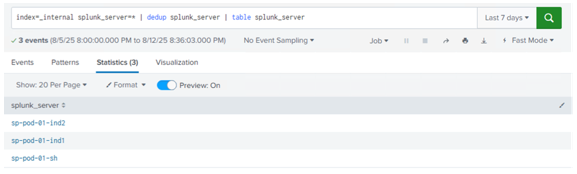
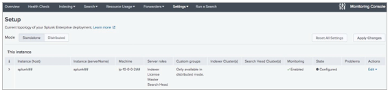
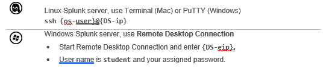

# Module 1 Lab Exercise – Explore your Splunk Lab Environment

## Objective:
By the end of the session, you will be able to:
- Objetive 1 - Welcome to your lab environment. In this exercise, you will perform basic configuration tasks using the Splunk Web interface and, using the CLI, investigate Splunk system settings.
Please ensure you are able to identify all of the following values that have been provided to you.
Your student ID is a unique digit identifier used throughout the lab exercises to uniquely identify your work from other class participants’ work. Substitute the “#” references in this lab document with your student ID, when asked to.
Student ID: {student-ID}

- Objetive 2 - Search Head Credentials
This lab environment uses a shared search head. Log into the search head using your unique assigned Splunk username. The Splunk power role has been assigned to your account. You will never log into the search head as admin.
Search Head Splunk Web URL: http://	  {SH-ip}   :8000                            
Splunk username: {user-ID}	Password: {password}

- Objetive 3 - Deployment Server/Test Server Credentials
You have been assigned your own deployment server/test server Splunk instance. The command line access procedure depends upon the underlying operating system (Linux or Windows). Splunk Web (browser) access procedures are the same regardless of the underlying operating system.
Deployment Server/Test Server Splunk Web URL: http://	:8000 {DS-ip}
Splunk username: admin	Password:	{password}
Linux OS
To access the Linux operating system, you will use an SSH client such as Mac Terminal or PuTTY (Windows).
Linux host IP address name: {DS-ip}
Linux Username: {os-user}	Password: {password}
Windows OS
To access the Windows operating system, you will use a Remote Desktop client (RDC), such as Microsoft Remote Desktop.
Windows host IP address name: {DS-ip}
RDC Username: student# Password: 

## Time for this activity:
- 30 minutes.

## Help Table:
Add a table with the information that participants may need during the lab, such as software version, server IPs, usernames, and access credentials.
| Password | Email | Code |
| --- | --- | ---|
| sp123 | ccabrerau@bancochile.cl | Splunk1 |
| sp124 | ecastillou@bancochile.cl | Splunk2 |
| sp125 | facabrera@bancochile.cl | Splunk3 |
| sp126 | jleonse@bancochile.cl | Splunk4 |
| sp127 | jnorambuen@bancochile.cl | Splunk5 |
| sp128 | jaguiar@bancochile.cl | Splunk6 |

## Instructions: 
<!-- Provide detailed steps on how to configure and manage systems, implement software solutions, perform security testing, or any other practical scenario relevant to the field of Information Technology -->

### Task 1. Access Splunk Web on the Search Head.
You will access the shared search head and your personal deployment/test server instances frequently with Splunk Web throughout the lab exercises. It is strongly recommended that you keep a separate tab or window open to each machine so you can context-switch easily between them when necessary. If you’re not sure which instance you are currently accessing, click the Settings menu. If you see an abridged list of options, you’re on the search head. If you see a full list of options, you’re on your deployment/test server. Another option is to use two different web browsers. For example, use Chrome to access your search head and Firefox to access the deployment test server. A third option is to change the color of the search app navigation bar. Your instructor may have already done this for the shared search head.

**Step 1.** Navigate to the search head (using your browser of choice)..

**Step 2.** Log in with your assigned {user-ID} and password {password}

**Step 3.** From the Splunk bar, to identify the Splunk version that the search head is running, click Help > About.

**Step 4.** From the Splunk bar, click your {SH_user-ID} name.

**Step 5.** Click Account Settings.

**Step 6.** In the Full name field, notice your name preceded by SH_. (This identified your login session and the search head.) Do not change.

**Step 7.** The Email address field contains a two-digit number. This is your {student-ID} (leading zero required for student IDs 01-09). Do not change.
NOTE:	Do not change your assigned password.

**Step 8.** From the Splunk bar, click your {SH_user-ID} name and click Preferences.

**Step 9.** In the Default application field, select Search & Reporting.

**Step 10.** Click Apply.

**Step 11.** In the app navigation bar, click Apps > Search & Reporting.

**Step 12.** Click Skip to dismiss the tour message.

**Step 13.** Click Settings. The options shown are the defaults available to the Splunk power role.

### Task 2. Run a search on the Search Head.

**Step 1.** To Identify some of the Splunk components in your environment, execute the following search over the last 7 days
index=_internal splunk_server=* | dedup splunk_server | table splunk_server

NOTE:	On a standard out-of-the-box server, power users cannot search the _internal index. This was modified in the training environment.
The table lists the Splunk servers that are currently searchable by the search head.
ip-10.0.0.111 – shared search head
ip-10.7.3X.13– shared Indexer 1
ip-10.7.3X.14 – shared Indexer 2
NOTE:	If you see more servers in your data table, it indicates other class participants have already completed subsequent lab exercises.

### Task 3. Use Splunk Web on the deployment server/test server to change server settings.

**Step 1.** Open a separate tab or window in your browser and navigate to your deployment/test server instance:
http://{DS-ip}:8000

**Step 2.** Log in as admin using your assigned password {password}.

**Step 3.** Click Skip to dismiss the Help us improve Splunk software message, if it appears.

**Step 4.** Click Settings.
The full list of options is displayed for this role. You are assigned the admin role with full administrator privileges on this Splunk instance.

**Step 5.** Notice your assigned user ID in the Splunk bar with a DS_ prefix. This identifies your login session and the deployment/test server. Do not change.

**Step 6.** Click {DS_user-ID} > Preferences.

**Step 7.** The Global setting should be selected, change the Time zone to your current time zone.

**Step 8.** Click Apply.

**Step 9.** Click {DS_user-ID} > Account Settings.
Notice in the Full name field your assigned {DS_user-ID}. Do not change.

**Step 10.** In the Email address field, should be blank.

**Step 11.** Navigate to Settings > Server settings > General settings.
The directory where Splunk is installed is referred to as SPLUNK_HOME. Record the path specified in the Installation path field here:

**Step 12.** Rename the Splunk server name and Default host name using the following convention: 
Splunk server name:	splunk#	where #is your {student-ID}
Default host name:	splunk#	where #is your {student-ID}

**Step 13.** Click Save.
Notice the message. Splunk must be restarted for changes to take effect.

**Step 14.** Click Messages > Click here to restart from Server controls > Restart Splunk > OK.

**Step 15.** After the restart, click OK and log back into Splunk Web.

### Task 4. View the changes made to the deployment/test server.

**Step 1.** To access the monitoring console, click Settings > Monitoring Console.

**Step 2.** From the app navigation menu, click Settings > General Setup.

**Step 3.** Verify the server name and note the discovered default server roles.

**Step 4.** Click Edit > Edit Server Roles. (You may need to scroll to the right in the table to see the Edit
hyperlink, depending on the size of your browser window.)

**Step 5.** Remove the check mark from Search Head, and select the check mark for Deployment Server, then click Save > Done.

**Step 6.** To complete the app setup, click Apply Changes > Go to Overview.

**Step 7.** On the Overview page, review the following:
•	Monitoring Console is running in standalone mode.
•	No errors are displayed.
•	No excessive resource usage is detected. The CPU Usage and Memory Usage rates should be low (less than 20%).

### Task 5. Retrieve Splunk settings from your deployment server using the CLI.

**Step 1.** Connect to your deployment server’s command line as follows:

**Step 2.** Navigate to the SPLUNK_HOME/bin (documented previously in Task 3, step 25.). For example:

**Step 3.** Use splunk help commands and splunk help show to obtain a list of Splunk CLI commands and syntax help.

**Step 4.** Execute the following CLI commands to check the status of your Splunk server and determine other details.

The output shows the running status and the splunkd and helper process IDs:
splunkd is running (PID: #####)
splunk helpers are running (PIDs #################)
The commands shown below assume that you are already in the SPLUNK_HOME/bin directory. Some commands will require you to log in as admin before executing. (user: admin, password: {password}, which is likely: splunk3du)

If you are on a Windows server, remove ./ from the commands. For example, type
splunk version, instead of ./splunk version
Splunk version	./splunk version
Splunk Web port:	./splunk show web-port returns 8000
Splunk management (splunkd) port:	./splunk show splunkd-port returns 8089 Splunk App Server ports:	./splunk show appserver-ports returns 8065 Splunk KV store port:	./splunk show kvstore-port returns 8191 Splunk server name:	./splunk show servername returns splunkXX
Default host name:	./splunk show default-hostname returns splunkXX

**Step 5.** Troubleshooting Suggestions
1.	If you can't access Splunk Web, make sure the Splunk service is running. In the terminal, run:

2.	If splunkd is not already running, start the splunkd service.

