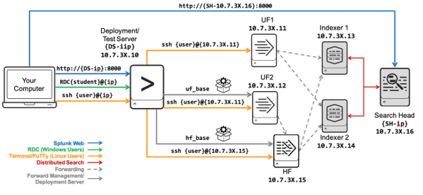

# Module 1 Lab Exercise – Explore your Splunk Lab Environment

## Objective:
By the end of the session, you will be able to:
- Objetive 1 - Welcome to your lab environment. In this exercise, you will perform basic configuration tasks using the Splunk Web interface and, using the CLI, investigate Splunk system settings.
Please ensure you are able to identify all of the following values that have been provided to you.
Your student ID is a unique digit identifier used throughout the lab exercises to uniquely identify your work from other class participants’ work. Substitute the “#” references in this lab document with your student ID, when asked to.
Student ID: {student-ID}

- Objetive 2 - Search Head Credentials
This lab environment uses a shared search head. Log into the search head using your unique assigned Splunk username. The Splunk power role has been assigned to your account. You will never log into the search head as admin.
Search Head Splunk Web URL: http://	  {SH-ip}   :8000                            
Splunk username: {user-ID}	Password: {password}

- Objetive 3 - Deployment Server/Test Server Credentials
You have been assigned your own deployment server/test server Splunk instance. The command line access procedure depends upon the underlying operating system (Linux or Windows). Splunk Web (browser) access procedures are the same regardless of the underlying operating system.
Deployment Server/Test Server Splunk Web URL: http://	:8000 {DS-ip}
Splunk username: admin	Password:	{password}
Linux OS
To access the Linux operating system, you will use an SSH client such as Mac Terminal or PuTTY (Windows).
Linux host IP address name: {DS-ip}
Linux Username: {os-user}	Password: {password}
Windows OS
To access the Windows operating system, you will use a Remote Desktop client (RDC), such as Microsoft Remote Desktop.
Windows host IP address name: {DS-ip}
RDC Username: student# Password: 

## Visual objective: 
Create a diagram or image that summarizes the activities to be carried out; an example is the following image.

## Time for this activity:
- 30 minutes.

## Help Table:
Add a table with the information that participants may need during the lab, such as software version, server IPs, usernames, and access credentials.
| Password | Email | Code |
| --- | --- | ---|
| Netec2024 | edgardo@netec.com | 123abc |

## Instructions: 
<!-- Provide detailed steps on how to configure and manage systems, implement software solutions, perform security testing, or any other practical scenario relevant to the field of Information Technology -->

### Task 1. Access Splunk Web on the Search Head.
You will access the shared search head and your personal deployment/test server instances frequently with Splunk Web throughout the lab exercises. It is strongly recommended that you keep a separate tab or window open to each machine so you can context-switch easily between them when necessary. If you’re not sure which instance you are currently accessing, click the Settings menu. If you see an abridged list of options, you’re on the search head. If you see a full list of options, you’re on your deployment/test server. Another option is to use two different web browsers. For example, use Chrome to access your search head and Firefox to access the deployment test server. A third option is to change the color of the search app navigation bar. Your instructor may have already done this for the shared search head.

**Step 1.** Navigate to the search head (using your browser of choice)..

**Step 2.** Log in with your assigned {user-ID} and password {password}

**Step 3.** From the Splunk bar, to identify the Splunk version that the search head is running, click Help > About.

**Step 4.** From the Splunk bar, click your {SH_user-ID} name.

**Step 5.** Click Account Settings.

**Step 6.** In the Full name field, notice your name preceded by SH_. (This identified your login session and the search head.) Do not change.

**Step 7.** The Email address field contains a two-digit number. This is your {student-ID} (leading zero required for student IDs 01-09). Do not change.
NOTE:	Do not change your assigned password.

**Step 8.** From the Splunk bar, click your {SH_user-ID} name and click Preferences.

**Step 9.** In the Default application field, select Search & Reporting.

**Step 10.** Click Apply.

**Step 11.** In the app navigation bar, click Apps > Search & Reporting.

**Step 12.** Click Skip to dismiss the tour message.

**Step 13.** Click Settings. The options shown are the defaults available to the Splunk power role.

### Task 2. Run a search on the Search Head.

**Step 1.** The instructor must describe each activity using the infinitive form of the verb, clearly and concisely, in order to build the task objective step by step.

**Step 2.** <!-- Add instruction, e.g., "To configure the network interface with the assigned IP address." -->

**Step 3.** <!-- Add instruction, e.g., "To verify connectivity by executing ping commands to the server." -->

## Expected result:

This section should show the expected outcome of our lab activity.

