# Module 10 Lab Exercise – Manipulating Data 

## Objective:
By the end of the session, you will be able to:
- Objetive - In this lab exercise, you ingest two log files on UF2 and perform the following data manipulation tasks on the heavy forwarder:
•	Evaluate data forwarded and mask account codes before data is transmitted to the indexers.
•	Configure data from the same source to be indexed into different indexes while filtering out (discarding) unwanted data, all based on a keyword match.

## Time for this activity:
- 35 minutes.

## Instructions: 
<!-- Provide detailed steps on how to configure and manage systems, implement software solutions, perform security testing, or any other practical scenario relevant to the field of Information Technology -->

### Task 1. Create a data masking transformation.
In this task, you use the Add Data wizard’s data preview feature to create a local data input and a new source type that contains custom parsing phase attributes. The custom attributes are needed to correctly parse events from a proprietary (not industry standard) log file.

**Step 1.** In a terminal window for the deployment/test server, open the sample file in a text editor.

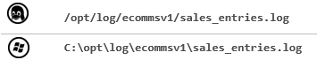

**Step 2.** Create a transforms.conf file using a text editor: 

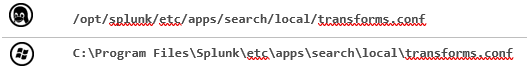

**Step 3.** Add the following stanza to mask the last four digits of the AcctCode field values:
[mask-acctcode]
REGEX = (.*AcctCode=\d{4}).* DEST_KEY = _raw
FORMAT = $1-XXXX

**Step 4.** Open the following props.conf file using a text editor:

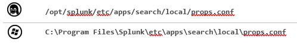

**Step 5.** Append the following stanza to invoke the acctmasking transformations for the sales_entries
source type:
[sales_entries]
TRANSFORMS-acctmasking = mask-acctcode

**Step 6.** Restart the deployment server.

### Task 2. Add a local file monitor input to test the transformation.

**Step 1.** Log back into the deployment/test server and launch the Add Data wizard.

**Step 2.** Add a Monitor (local) input and, on the Select Source step, select Files & Directories.

**Step 3.** Click Browse and select the following file:

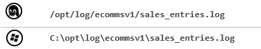

**Step 4.** Verify Continuously Monitor is selected and click Next.

**Step 5.** Click Source type: default and type “sales”. 
The sales_entries source type should display.

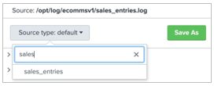

**Step 6.** Select sales_entries for the source type.
After selecting the sales_entries sourcetype, the AcctCode values in the data preview pane should be masked.

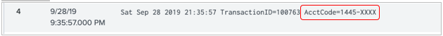

IMPORTANT: If the AcctCode values are not masked, then QUIT the Add Data wizard by clicking on the Splunk logo. Verify the syntax and spelling carefully in transforms.conf and props.conf (see Task 1A, Steps 2-5) and repeat this step.

**Step 7.** Click Next and select test for the index setting.

**Step 8.** Click Review and verify that your input matches the following before clicking Submit. 
Input Type	File Monitor
Source Path	/opt/log/ecommsv1/sales_entries.log
C:\opt\log\ecommsv1\sales_entries.log
Continously Monitor	Yes
Source Type	sales_entries
App Context	search
Host	splunk#
Index	test

**Step 9.** From the deployment/test server, execute the following search over the Last 7 days, replacing the # with your student ID:
index=test sourcetype=sales_entries host=splunk#

You should see events with the last four digits of the AcctCode field masked.

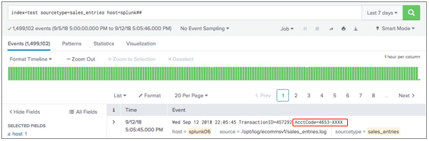

### Task 3. Copy the props and transforms file definitions to the hf_base app and deploy them to the HF.

**Step 1.** Copy the contents of the props.conf file to the hf_base directory.

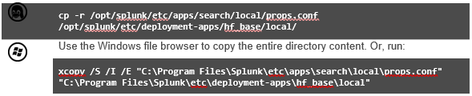

**Step 2.** Copy the contents of the transforms.conf file to the hf_base directory.

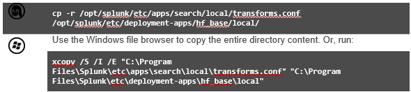

**Step 3.** Reload the deployment server. (Splunk may ask you to login as the admin Splunk user).

**Step 4.** Remote SSH to HF(10.7.3X.15) and confirm the new [sales_entries] stanza below appears with the other stanzas in the deployed props.conf file.

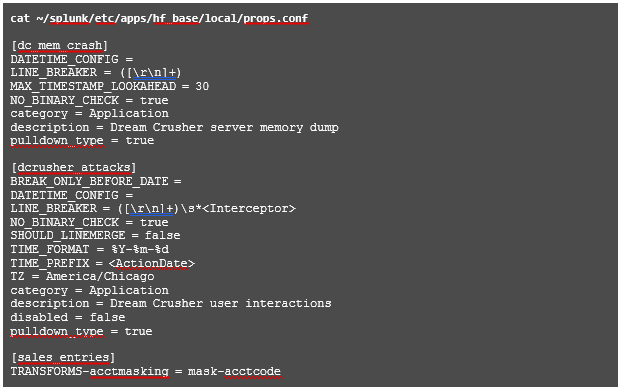

**Step 5.** Confirm the new stanza appears in the deployed transforms.conf file.

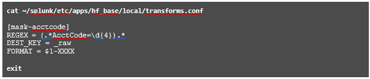

### Task 4. Deploy a file monitor to UF2 to transmit the sales_entries.log data.

**Step 1.** 21.	Launch the Add Data wizard and add a Forward input to monitor sales_entries.log on UF2. Send the data to the itops index.
•	On the Select Forwarders step: 
Selected Server Class	New
Selected host(s)	LINUX|IP 10.7.3X.12
New Server Class Name	eng_saleslog
•	On the Select Source step, select Files & Directories:
File or Directory	/opt/log/ecommsv1/sales_entries.log
•	On the Input Settings step:
Source type	Select, type “sales” and select sales_entries
Index	itops

**Step 2.** 22.	Verify the Review page matches the following before clicking Submit: 
Server Class Name	eng_saleslog
List of Forwarders	LINUX|IP 10.7.3X.12
Input Type	File Monitor
Source Path	/opt/log/ecommsv1/sales_entries.log
Whitelist	N/A
Blacklist	N/A
Source Type	sales_entries
Index	itops

**Step 3.** 23.	From your search head, execute the following search over All Time, replacing the #with your student ID:
index=itops sourcetype=sales_entries host=engdev2#

You should see events from UF2 with the last four digits of the AcctCode field masked. It may take a few minutes for the results to appear.

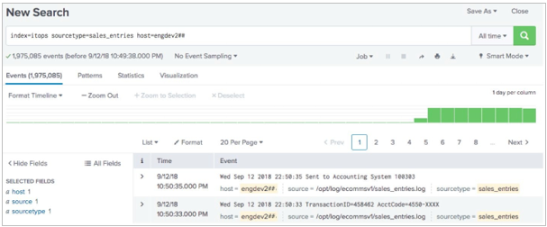

**Step 4.** Troubleshooting Suggestions
If your searches are not producing the expected results, check your configurations.
1.	Verify the syntax and spelling in all configurations and searches.
