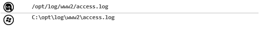
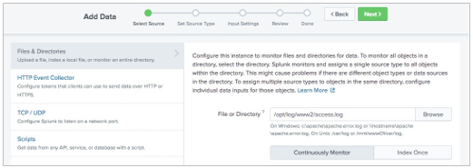
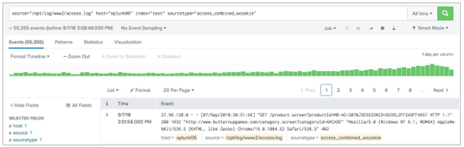
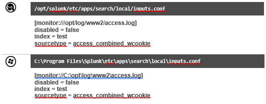
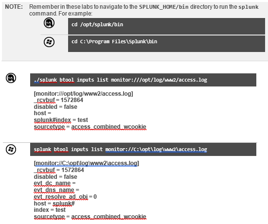
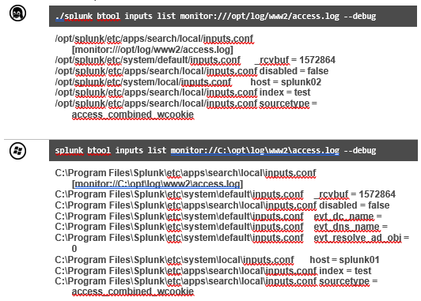

# Module 2 Lab Exercise – Add a Local Data Input 

## Objective:
By the end of the session, you will be able to:
- Objetive 1 - In this lab exercise, you will create all the local indexes on the deployment/test server required for the subsequent lab exercises. In later lab exercises, you will forward data inputs to remote indexers. This requires that your deployment/test server have the same local indexes as the remote indexers. Finally, you will create a local file input (monitor) to be indexed on your deployment/test server.

## Time for this activity:
- 30 minutes.

## Help Table:
Add a table with the information that participants may need during the lab, such as software version, server IPs, usernames, and access credentials.
| Password | Email | Code |
| --- | --- | ---|
| Netec2024 | edgardo@netec.com | 123abc |

## Instructions: 
<!-- Provide detailed steps on how to configure and manage systems, implement software solutions, perform security testing, or any other practical scenario relevant to the field of Information Technology -->

### Task 1. Create the local indexes on the deployment/test server.

**Step 1.** Access Splunk Web on the deployment/test server, click Settings > Indexes.

**Step 2.** Click New Index.

**Step 3.** Populate the form as follows: 
Index Name:	test
Index Data Type:	Events (default)
App:	Search & Reporting
(This saves the configurations within the Search app-context).

Leave the rest of the fields empty to accept the defaults.

**Step 4.** Click Save.

**Step 5.** Repeat steps 1 through 5 to create the following indexes:
•	itops
•	sales
•	securityops
•	websales

### Task 2. Index events from an access.log file to a test index.

**Step 1.** Click Settings > Add Data.

**Step 2.** If you see the Welcome, Administrator tour message, click Skip.

**Step 3.** Click Monitor to launch the Add Data wizard.

**Step 4.** On the Select Source step, click Files & Directories.

**Step 5.** Click Browse, navigate to the file listed below, click the file name (access.log), then click Select:

**Step 6.** Make sure Continuously Monitor is selected.
NOTE:	This selection creates a monitor stanza in the inputs.conf file. (The inputs.conf is created if it does not already exist.)

**Step 7.** Click Next to go to the Set Source Type page.
NOTE:	Splunk auto-selected the access_combined_wcookie source type. This will be discussed later.

**Step 8.** Click Next again to go to the Input Settings page and confirm the following selection: App Context: Search & Reporting
Host field value: splunk#(The #should be your Student ID number)

**Step 9.** For Index, select test.

**Step 10.** Click Review. The summary of the input should look as follows: 
Input Type	File Monitor
Source Path	C:\opt\log\www2\access.log (Windows server)
/opt/log/www2/access.log (Linux server)
Continuously Monitor	Yes
Source Type	access_combined_wcookie
App Context	search
Host	splunk#
Index	test

**Step 11.** Click Submit.

### Task 3. Confirm your input configuration.

**Step 1.** To verify your monitor input, click Start Searching.

**Step 2.** Click Skip to dismiss any message that may appear.

**Step 3.** Observe the search string: 
Linux server:
source="/opt/log/www2/access.log" host="splunk#" index="test" sourcetype="access_combined_wcookie"
Windows server:
source="C:\\opt\\log\\www2\\access.log" host="splunk#" index="test" sourcetype="access_combined_wcookie"

**Step 4.** Observe the automatically extracted field names and values:

### Task 4. View the input stanza.

**Step 1.** From your deployment server’s command line (or text editor), review the contents of the
inputs.conf file created by the Add Data wizard and verify the following stanza:

NOTE:	If Continuously Monitor was not selected during the creation of your input, then Splunk does not create the above stanza.

**Step 2.** Use the btool command to show all of the Splunk settings associated with the creation of the data input.

NOTE:	The _rcvbuf field shows the receive buffer default used for UDP port input. The host field shows the default hostname as defined in $SPLUNK_HOME/etc/system/local/inputs.conf (on Linux) or C:\SPLUNK_HOME\etc\system\local\inputs.conf (on Windows).

**Step 3.** Use the btool command with the --debug flag to show all of the Splunk settings associated with the creation of the data input.

