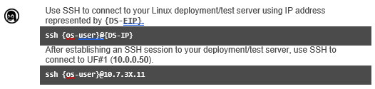
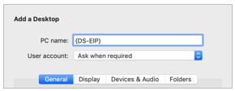
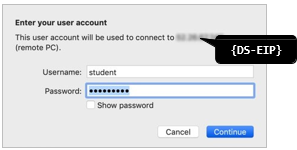
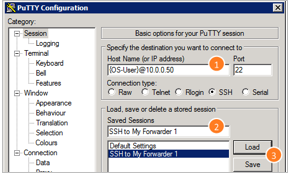

# Module 3 Lab Exercise – Setting Up Forwarders 

## Objective:
By the end of the session, you will be able to:
- In this exercise, you configure universal forwarder #1 (UF1) to send data to the remote indexers (IND1 and IND2) and validate the receipt of internal splunkd data on the shared search head.

## Time for this activity:
- 30 minutes.

## Instructions: 
<!-- Provide detailed steps on how to configure and manage systems, implement software solutions, perform security testing, or any other practical scenario relevant to the field of Information Technology -->

### Task 1. Connect to Universal Forwarder #1 (UF1).

**Step 1.**  Connect to the UF1 using the following OS-specific instructions:

Use an RDC (Remote Desktop client) connection window to connect to your Windows deployment/test server using the designated IP address value for
{DS-EIP}.

Open a remote desktop connection to the window and login using {os-user}
(normally set to student, on Windows).

After connecting to your deployment/test server, locate PuTTy on the desktop:

Double-click the PuTTy application to open it, and configure an SSH session to UF1 with the following steps:
a.	❶ Replace {os-user}@10.7.3X.11 with your designated values.
b.	❷ Name your session and ❸ Save.
c.	Click Open to start the session.

**Step 2.** Click Yes to accept the server’s host key and enter your password. After connected to UF1 (10.7.3X.11), the command prompt indicates the location:

### Task 2. Description of the task to be performed.

**Step 1.** The instructor must describe each activity using the infinitive form of the verb, clearly and concisely, in order to build the task objective step by step.

**Step 2.** <!-- Add instruction, e.g., "To configure the network interface with the assigned IP address." -->

**Step 3.** <!-- Add instruction, e.g., "To verify connectivity by executing ping commands to the server." -->

## Expected result:

This section should show the expected outcome of our lab activity.

