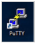

# Module 3 Lab Exercise – Setting Up Forwarders 

## Objective:
By the end of the session, you will be able to:
- In this exercise, you configure universal forwarder #1 (UF1) to send data to the remote indexers (IND1 and IND2) and validate the receipt of internal splunkd data on the shared search head.

## Time for this activity:
- 30 minutes.

## Instructions: 
<!-- Provide detailed steps on how to configure and manage systems, implement software solutions, perform security testing, or any other practical scenario relevant to the field of Information Technology -->

### Task 1. Connect to Universal Forwarder #1 (UF1).

**Step 1.**  Connect to the UF1 using the following OS-specific instructions:

Use an RDC (Remote Desktop client) connection window to connect to your Windows deployment/test server using the designated IP address value for
{DS-EIP}.

Open a remote desktop connection to the window and login using {os-user}
(normally set to student, on Windows).

After connecting to your deployment/test server, locate PuTTy on the desktop:

Double-click the PuTTy application to open it, and configure an SSH session to UF1 with the following steps:
a.	❶ Replace {os-user}@10.7.3X.11 with your designated values.
b.	❷ Name your session and ❸ Save.
c.	Click Open to start the session.

**Step 2.** Click Yes to accept the server’s host key and enter your password. After connected to UF1 (10.7.3X.11), the command prompt indicates the location:

### Task 2. Start and configure your forwarder instance.

**Step 1.** The instructor must describe each activity using the infinitive form of the verb, clearly and concisely, in order to build the task objective step by step.

**Step 2.** To initialize the UF1, run the following commands:

NOTE:	This option automatically accepts the Splunk EULA. The admin password and the splunkd-port have already been configured for you. If you want to change your splunkd-port, you may need to check with your Splunk System Administrator and use ./splunk set splunkd-port <port_number>.

**Step 3.** Using the show command, view the splunkd-port number (Splunk will prompt you for the admin
username and password which is admin and your assigned password.)

**Step 4.** Using the set command, change your forwarder's servername and the default-hostname to
engdev1{student-ID}.
This step uniquely identifies the data originating from your forwarder instance in this lab environment.
NOTE:	Defer the restart until you have made all your changes.

**Step 5.** Restart UF1 to apply your changes.

### Task 3. Configure your forwarder to send data directly to the indexers.

In this task, you configure UF1 to send its internal Splunk logs, and any data it gathers in later lab exercises, directly to the pre-configured Splunk indexers.

**Step 1.** Configure the forwarder to send data to port 9997 on your Splunk indexers, 10.7.3X.13 and
10.7.3X.14.
NOTE:	The remote indexer ports have been preconfigured to receive data.

**Step 2.** Verify your forwarder is properly configured.
NOTE:	The indexers will alternate between Active and Configured but inactive forwards due to load balancing. You may need to run the command multiple times to view these states.

**Step 3.** Use the btool command with the --debug flag to show all of the Splunk settings associated with the creation of the outputs.conf file.

**Step 4.** Restart UF1 to apply your new changes.

**Step 5.** Exit UF1’s SSH session.

### Task 4. Validate the receipt of forwarded data.

**Step 1.** Using the search head, enter the search below. Replace the #’s with your student ID and execute the following search over the Last 15 minutes:
index=_internal sourcetype=splunkd host=engdev#

**Step 2.** You should see events related to the splunkd process coming from your UF1.
