# Module 4 Lab Exercise – Configure Forwarder Management 

## Objective:
By the end of the session, you will be able to:
- Objetive 1
Description
In this exercise, you will use the Forwarder Management interface in Splunk Web to configure a remote universal forwarder and a heavy forwarder. The advantage of this option is that it allows you to manage multiple groups of forwarders from a central location.

First, you will enable the deployment server feature on your deployment server instance and stage two deployable apps for your forwarders that have already been created for you. You will use these apps to configure the outputs.conf file which is needed to tell the fowarder where to send its data. The apps, uf_base for universal forwarder #2 (UF2) and hf_base for the heavy forwarder, are staged in SPLUNK_HOME/etc/deployment-apps.
Next, you will launch a second universal forwarder (10.7.3X.12) and a heavy forwarder (10.7.3X.15) and configure them as deployment clients.

Finally, you will define a serverclass in the Forwarder Management UI of the deployment server to deploy the uf_base and hf_base apps to their correct forwarders. The serverclass associates deployable apps with deployment clients.
IMPORTANT:	Completing this lab exercise is crucial because it is a prerequisite to several subsequent lab exercises.

## Time for this activity:
- 45 minutes.

## Instructions: 
<!-- Provide detailed steps on how to configure and manage systems, implement software solutions, perform security testing, or any other practical scenario relevant to the field of Information Technology -->

### Task 1. Copy the uf_base app to the deployment-apps directory and configure outputs.conf.
In this first task, you will copy the uf_base app and stage the app to be deployed to UF2. The
outputs.conf file will be configured to send its data to the receiving port of the heavy forwarder.

**Step 1.** Access your deployment server’s command line (SSH for Linux, RDC for Windows).

**Step 2.** Copy the entire uf_base directory from /opt/apps to SPLUNK_HOME/etc/deployment-apps/

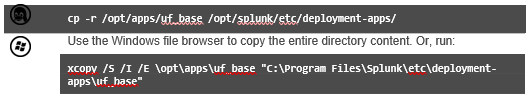

**Step 3.** Navigate to the local directory of the uf_base app and list its contents to make sure the
outputs.conf file was copied successfully.

NOTE:	You will also see a deploymentclient.conf file in the local directory. This file is also deployed to the forwarder to reduce the polling interval (how often the deployment client contacts the deployment server) from 60 seconds (default) to 30 seconds.

**Step 4.** Using a text editor, add the stanza below to the outputs.conf file. (Linux users can use vi or nano, Windows users can use Notepad++.)

NOTE:	Most Splunk configuration file contents are case-sensitive. If you copy and paste from the PDF lab document to populate configuration files, make sure the contents are exactly as shown in the steps.
Windows Users: You must have administrator rights when editing the Splunk configuration files in the lab environment. Use the Notepad++ icon on the desktop to launch the application with administrator rights. If you are not sure, you can use the following guidelines for opening and saving the files.
•	Right-click the Notepad++ and select Run as administrator.
•	When saving files, click Save as and use the All types (*.*) option. Do not save your files as text files (*.txt files).

[tcpout]
defaultGroup = default-autolb-group
[tcpout-server://10.7.3X.15:9997]
[tcpout:default-autolb-group] disabled = false
server = 10.7.3X.15:9997

**Step 5.** Save and close the edited file.

### Task 2. Configure universal forwarder #2 (UF2) as a deployment client.
In this task, you manually configure the forwarder as a deployment client by using the splunk set deploy-poll command. Since many Splunk environments use hundreds or thousands of forwarders, this is not practical or scalable. Most Splunk customers use a third-party software configuration management tool, such as Puppet or Chef. Another option is to include the Universal Forwarder software with a deploymentclient.conf file into pre-configured software builds.

**Step 1.** From your deployment server’s command line, SSH into your UF2 (10.7.3X.12). (Refer to Task 1 of the previous exercise for OS-specific instructions.)

**Step 2.** Navigate to the bin directory and initialize the forwarder with the --accept-license option.

**Step 3.** Use the CLI to determine the auto-assigned management port number. (Splunk will prompt you for the admin username and password which is admin and your assigned password.)

**Step 4.** Using the set servername and set default-hostname commands, change your forwarder's server name and default hostname to engdev2{student-id}:
This step uniquely identifies the data originating from your forwarder instance in this lab environment.
NOTE:	Defer the restarts until you have made all your changes.

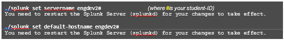

**Step 5.** 10.	Use the set deploy-poll command to establish communication between the forwarder and the deployment server, then restart the forwarder.

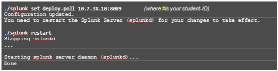

**Step 6.** Use the show deploy-poll command to verify the deployment-client configuration.
NOTE:	10.7.3X.10 is the internal address of your deployment server instance.

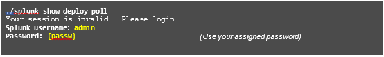

**Step 7.** Use the btool command with the --debug flag to show all of the Splunk settings associated with the creation of the deploymentclient.conf file.

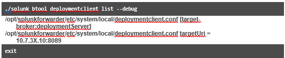

### Task 3. Copy the hf_base app to the deployment-apps directory and configure outputs.conf.
Copy the hf_base app and stage the app to be deployed to heavy forwarder. The outputs.conf file has been pre-configured so that the heavy forwarder will send its data to the receiving ports of the remote indexers.

**Step 1.** Access your deployment server’s command line (SSH for Linux, RDC for Windows).

**Step 2.** Copy the entire hf_base directory from /opt/apps to SPLUNK_HOME/etc/deployment-apps/

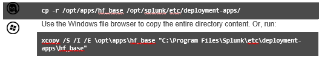

**Step 3.** Navigate to local directory of the hf_base app and list its contents to make sure the outputs.conf
file was copied successfully.

**Step 4.** Read the contents of the outputs.conf file:

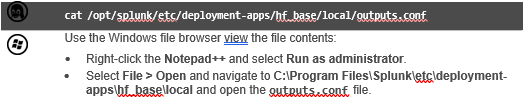

[tcpout]
defaultGroup = default-autolb-group [tcpout-server://10.7.3X.13:9997] [tcpout-server://10.7.3X.14:9997]
[tcpout:default-autolb-group] disabled = false
server = 10.7.3X.13:9997,10.7.3X.14:9997

### Task 4. Configure the heavy forwarder (HF) as a deployment client.
Enable the listening port on the heavy forwarder to listen for Splunk data being transmitted from UF2. Then, manually configure the heavy forwarder as a deployment client by using the splunk set deploy- poll command.

**Step 1.** From your deployment server’s command line, SSH into your HF (10.7.3X.15). (Refer to Task 1 of the previous exercise for OS-specific instructions.)

**Step 2.** Navigate to the bin directory and initialize the forwarder with the --accept-license option.

**Step 3.** Use the CLI to determine the auto-assigned management port number. (Splunk will prompt you for the admin username and password which is admin and your assigned password.)

**Step 4.** Set up the receiving port on your heavy forwarder to receive data from UF2.

**Step 5.** Using the set servername and set default-hostname commands, change your heavy forwarder's server name and default hostname to splunkHF{student-id}:
This step uniquely identifies the data orginating from your forwarder instance in this lab environment.

NOTE:	Defer the restarts until you have made all your changes.

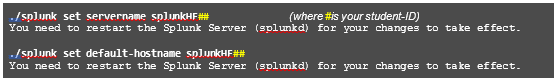

**Step 6.** Use the set deploy-poll command to establish communication between the forwarder and the deployment server, then restart the forwarder.

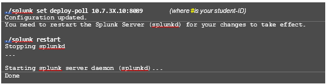

**Step 7.** Use the show deploy-poll command to verify the deployment-client configuration.
10.7.3X.10 is the internal address of your deployment server instance.

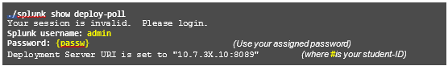

**Step 8.** Use the btool command with the --debug argument to show all of the Splunk settings associated with the creation of the deploymentclient.conf file.

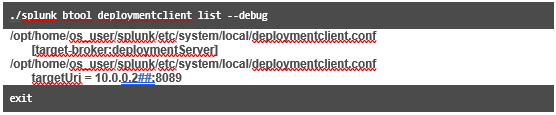

### Task 5. Add a server class to manage the HF from your deployment server.
You should now have two deployment apps and two deployment clients running. To complete the forwarder management enablement, you will need to configure a server class for each deployment client and assign the appropriate app. In this task, you will create a server class for the HF client and assign it the hf_base app.

**Step 1.** Log into Splunk Web as admin on the deployment server.

**Step 2.** Navigate to Settings > Forwarder management.

**Step 3.** Select the Configurations tab. The hf_base and uf_base apps should display.

**Step 4.** Select the Forwarders tab. The host (heavy forwarder) and (UF2) should display as Splunk GUI
NOTE:	It can take several minutes before your clients appear in the user interface. Proceed to the next steps while waiting for the full connection.

**Step 5.** On the Server Classes tab, click New Server Class.

**Step 6.** In the New Server Class window, name the server class eng_hf and click Save.

**Step 7.** To add the hf_base app to the server class, click Edit Configuration.

**Step 8.** Click the hf_base app to move it to the Selected Apps panel, then click Save. The After Installation column of the hf_base app currently shows Enabled App.

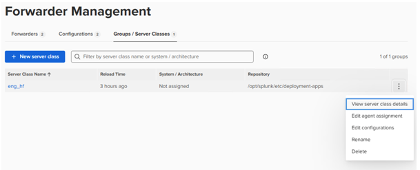

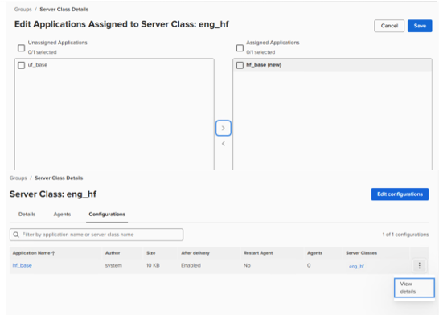

**Step 9.** Click in View details

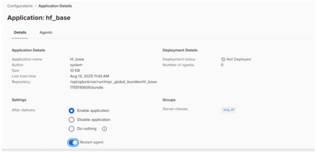

**Step 10.** On the Application Details: hf_base page, select the Restart agent check box, then click Save.

**Step 11.** Select the Server Classes tab, click action, then Edit agent assignment

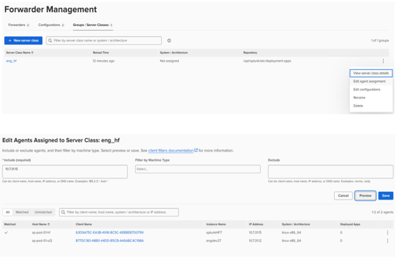

**Step 12.** Enter the deployment client's IP address 10.7.3X.15 to the Include (whitelist) box.

**Step 13.** Click Preview.

**Step 14.** When the check mark appears in the Matched column, click Save.

### Task 6. Add a server class to manage UF2 from your deployment server.

**Step 1.** From the Server Classes tab, click New Server Class.

**Step 2.** In the New Server Class window, name the server class eng_uf and click Save.

**Step 3.** To add the uf_base app to the server class, click Edit Configuration.

**Step 4.** Click the uf_base app to move it to the Selected Apps panel, then click Save.

**Step 5.** In the After Installation column of the uf_base app, it displays Enabled App.

**Step 6.** Click Edit > Edit.

**Step 7.** On the Edit App: uf_base page, select the Restart Splunkd check box, then click Save.

**Step 8.** Click the Server Classes tab.

**Step 9.** In the Actions column, click Edit > Edit Clients of the eng_uf server class.

**Step 10.** Enter the deployment client's IP address 10.7.3X.12 to the Include (whitelist) box.

**Step 11.** Click Preview.

**Step 12.** When the check mark appears in the Matched column, click Save.

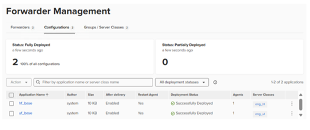

### Task 7. Confirm the deployment of the hf_base app.

**Step 1.** From your heavy forwarder (10.7.3X.15) terminal window, confirm that the directory hf_base exists in the ~/splunk/etc/apps directory.

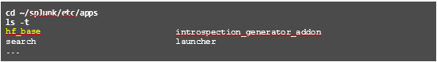

**Step 2.** Verify that the outputs.conf file matches the following, then exit the SSH session.

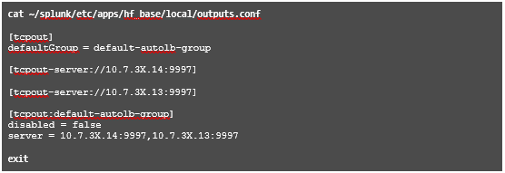

### Task 8. Confirm the deployment of the uf_base app.

**Step 1.** 53.	From your UF#2 (10.7.3X.12) terminal window, confirm that the directory uf_base exists in the
~/splunkforwarder/etc/apps directory.

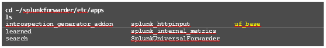

**Step 2.** 54.	Verify that the outputs.conf file matches the following, then exit the SSH session.

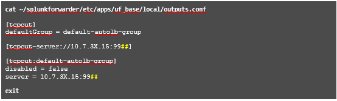

**Step 3.** 55.	From the search head, replace the #with your student ID and execute the following search over the
Last 24 hours
index=_internal sourcetype=splunkd tcpoutputproc host=*#| stats count by host

**Step 4.** 56.	You should now see following hosts:
•	engdev1#	(UF1, #= student id)
•	engdev2#	(UF2, #= student id)
•	splunkHF#	(Heavy Forwarder, #= student id)

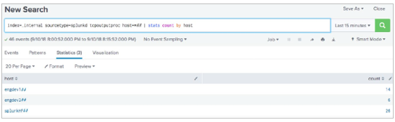

Note: If you see other additional hosts in your search, don’t worry — it means they have already been communicating for a longer time. 

**Step 5.** Troubleshooting Suggestions
If your deployment is not indexing the internal events from UF2 and the heavy forwarder, check the following:
1.	A common error is running the forwarder commands on the deployment server. In Splunk Web, navigate to Settings > Monitoring Console > Indexing > Performance > Indexing Performance: Instance.
The fill ratio of each queue in the Splunk Enterprise Data Pipeline should be at 0% or near zero.
2.	Verify the apps are located in the SPLUNK_HOME/etc/deployment-apps directory on the deployment server. You should have two directories; hf_base and uf_base.
3.	Remote SSH to your heavy forwarder (10.7.3X.15), and verify that your heavy forwarder is polling your deployment server:
~/splunk/bin/splunk show deploy-poll
If you need to reset the URI, run:
~/splunk/bin/splunk set deploy-poll 10.7.3X.10:8089
~/splunk/bin/splunk restart
4.	From your heavy forwarder (10.7.3X.15), verify the correct port is enabled.:
~/splunk/bin/splunk display listen (the output should be 9997). If you need to reset the port, run:
~/splunk/bin/splunk enable listen 9997
~/splunk/bin/splunk restart
5.	Remote SSH into your UF2 (10.7.3X.12) and verify your forwarder is polling your deployment server:
~/splunkforwarder/bin/splunk show deploy-poll
If you need to reset the URI, run:
~/splunkforwarder/bin/splunk set deploy-poll 10.7.3X.10:8089
~/splunkforwarder/bin/splunk restart
6.	Verify the forwarding destination and receiving host ports are configured correctly and are active for every Splunk component.
From UF2, run: ./splunk list forward-server
Verify the heavy forwarder (10.7.3X.15) is listed under Configured but inactive forwards, then restart the forwarder.
From the heavy forwarder run: ./splunk list forward-server
Verify the indexers (10.7.3X.13and 10.7.3X.14) are listed under Configured but inactive forwards, then restart the forwarder.
If you see any mistakes, edit the outputs.conf file under SPLUNK_HOME/etc/deployment- apps/[uf_base|hf_base]/local/ on the deployment server and re-deploy the app.
7.	Check splunkd.log on the forwarder for any recent error or warnings (typically within five minutes).
cat ~/splunkforwarder/var/log/splunk/splunkd.log | grep 'ERROR\|WARN'
Or, egrep 'ERROR|WARN' ~/splunkforwarder/var/log/splunk/splunkd.log
8.	If you still don't get results, ask your instructor for help.
