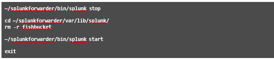

# Module 5 Lab Exercise – File Monitor Input 

## Objective:
By the end of the session, you will be able to:
- Objetive - Description
In this exercise, you will test a local directory monitor input on your deployment server/test server. After confirming the events are indexed into the test index on the test server, you will use the Add Data wizard to index the same directory located on UF2 and deploy the input to the test index located on the remote indexers (IDX1 and IDX2). Finally, you will manually edit the attributes of the inputs.conf to construct a production-ready input and re-index all of the data properly in your production index.

## Time for this activity:
- 35 minutes.

## Instructions: 
<!-- Provide detailed steps on how to configure and manage systems, implement software solutions, perform security testing, or any other practical scenario relevant to the field of Information Technology -->

### Task 1. Add a test directory monitor input to an index on the Deployment Server.
In this task, you will test a local input directory monitor input to index selective directories on the forwarder in bulk. You will use the whitelist and blacklist attributes to define and limit which files are indexed.

**Step 1.** On your deployment server in the Splunk Web interface, click Settings > Add Data > Monitor.

**Step 2.** On the Select Source step, click Files & Directories.

**Step 3.** Click Browse, navigate to the directory below and click Select.

**Step 4.** On the Select Source step, type www for the Whitelist and secure for Blacklist and then click Next.

**Step 5.** On the Input Settings step, select the following options and click 
Review: Sourcetype:	Automatic
App Context:	Search & Reporting (search)
Host field value:	splunk#(#should match your student ID)
Index:	test

**Step 6.** Verify the settings on the Review step match the following: 
Input Type	Directory Monitor
Source Path	/opt/log (Linux Server)
C:\opt\log (Windows Server)
Whitelist	www
Blacklist	secure
Source Type	Automatic
App Context	search
Host	splunk#
Index	test

**Step 7.** Click Submit.

**Step 8.** To verify your monitor input, click Start Searching. (If you get a Welcome message, click Skip.)

**Step 9.** Observe the search string (using #to match your student ID): Linux server:
source="/opt/log/*" host="splunk#" index="test"
Windows server:
source="C:\\opt\\log\\*" host="splunk#" index="test"

**Step 10.** Observe the automatically extracted field names.
In the fields sidebar, click the host, source, and sourcetype fields. You should see the following field values:
host:	splunk#
source (3 total):	/opt/log/www1/access.log
/opt/log/www2/access.log
/opt/log/www3/access.log
sourcetype:	access_combined_wcookie

**Step 11.** From your deployment server, view the inputs.conf file and verify the new stanza.

### Task 2. Add a directory monitor input to index remote data from UF2.
Now that you have successfully indexed a directory monitor input on your test server, you will index the same directories located on UF2 to the remote indexes located on indexers (IDX1 and IDX2). The Add Data wizard’s forward feature automatically creates the inputs.conf file in a deployable app on the deployment server. It then automatically deploys the app to the forwarder(s) you select on the first page of the wizard.

NOTE:	Windows users are still using Linux forwarders. Use the Linux path file as indicated in the input specifications.

**Step 1.** On your deployment server, click Settings > Add Data > Forward.

**Step 2.** On the Select Forwarders step, configure the form as follows and click Next:
•	Select Server Class: New
•	Selected host(s): LINUX IP 10.7.3X.12
•	New Server Class Name: eng_webservers

**Step 3.** On the Select Source step, click Files & Directories and configure the form as follows, and click
Next:
•	File or Directory: /opt/log
•	Whitelist: www
•	Blacklist: secure

**Step 4.** For the Input Settings, leave the Source type as Automatic and select test for the Index and click
Review.

**Step 5.** Verify your settings match the following, then click Submit: 
Server Class Name	eng_webservers
List of Forwarders	LINUX|IP 10.7.3X.12
Input Type	File Monitor
Source Path	/opt/log
Whitelist	www
Blacklist	secure
Sourcetype	Automatic
Index	test

NOTE:	Do not click Start Searching! Remember, you just deployed this input to your second forwarder and in the previous lab exercise, you deployed an outputs.conf file to that forwarder telling it to send all of its data directly to the indexers. Therefore, if you search for the data on your local instance (deployment server/heavy forwarder), you would see the local data you indexed in Task 1, not the data from the universal forwarder.

**Step 6.** Open Splunk Web on your search head. Replace the #with your student ID and execute the following search over the Last 4 hours:
index=test host=engdev2#

**Step 7.** In the fields sidebar, click the host, source, and sourcetype fields. You should see the following field values:
host:	engdev#
source (3 total):	/opt/log/www1/access.log
/opt/log/www2/access.log
/opt/log/www3/access.log
sourcetype:	access_combined_wcookie

NOTE:	It may take a few minutes before you see results from all three sources. If your search results match the output above, then you can move on to the next task. If no results are found, wait a minute and try again. If the search continues to not show all 3 sources
even after waiting a few minutes, review the Troubleshooting Suggestions section.

### Task 3. Customize the inputs.conf file manually and re-index to the sales index.
The test run shows that the host value is set to the default-hostname of the forwarder. The Add Data wizard does not provide alternate ways to set the host name when adding a remote directory monitor. You will manually edit the app's inputs.conf on the deployment server so that it uses an explicit value for host and routes the data to the sales index. You will then re-deploy the updated input to the forwarder. After the updated input is deployed to the forwarder, any new data is sent to sales index, but the data that was indexed into the test index is not automatically re-indexed. You will have to manually reset the file checkpoints on the forwarder to force all of the data to be re-transmitted.

**Step 1.** From your deployment server, open the inputs.conf file (created by the Add Data wizard in Task 1) with a text editor located in the following directory:

**Step 2.** Edit and save the monitor stanza as follows: (Windows users, be sure to close the file after the edit.)
[monitor:///opt/log] blacklist = secure disabled = false
index = sales	(Update)
whitelist = www
host = www-#	(Add and replace #with your student ID)

NOTE:	Any time you update Splunk configuration files in a deployable app at the filesystem-level, the deployment server doesn’t know the files have changed, so it doesn’t update the checksum value it uses to compare the version of the app on the server with the version of the app on the client. The reload deploy-server command causes the deployment server to re-cache the deployable apps and updates the checksum values of any apps that have changed since the last re-cache without having to restart the deployment server. The next time the client phones home, the checksum values of the app will be different, causing the app to be re-deployed.

**Step 3.** To re-deploy the new inputs.conf settings, run this command (Splunk may prompt you for the admin username and password which is admin and your assigned password.):

**Step 4.** Remote SSH into your UF2 (10.7.3X.12) and verify the update has been deployed.

**Step 5.** Trigger the re-indexing of the data in the sales index by resetting the monitor checkpoints on the forwarder. Although the supported method is to use btprobe to reset each monitored input, this is a test system, so we can use the simple (but also dangerous) methods of either removing the fishbucket folder, or using the splunk clean eventdata command. We will show all methods in the step and notes below, however only one of these methods needs to be used in the lab.

The following commands stop splunk, remove the fishbucket directory that stores all the fishbucket related files, and then starts splunk. Note that this affects all monitored inputs, however because we are on a test system where we want to reset all checkpoints, this is not a concern.

NOTE:	Instead of removing the fishbucket folder, the supported method of resetting monitored file inputs individually on a “production” system is by using the btprobe command:

Another method for resetting all monitored inputs is running the splunk clean eventdata
-index _thefishbucket command and restarting Splunk. This command should be used with caution, as typos or running on incorrect systems can have disastrous consequences: Running splunk clean without the -index option will remove all indexes from that Splunk instance. In this lab, instead of removing the fishbucket folder or running the btprobe commands, you could instead run:

### Task 4. Verify your forwarder is sending the events to the indexer.

**Step 1.** From your search head, replace the # with your student ID and execute the following search over the Last 4 hours:
index=sales host=www-#

Eventually, you should see one sourcetype and three sources in your search results. It may take a few minutes before you see all 3 sources.

**Step 2.** Troubleshooting Suggestions
1.	On your deployment server, navigate to the Settings > Forwarder management page and click the
Clients tab.
Verify your client is still phoning home and has reported 2 deployed apps.
2.	Remote SSH into UF2 (10.7.3X.12) and confirm the deployed input stanza:
1st phase deployment:

2nd phase deployment:

3.	If you need to make changes, edit the inputs.conf file on the deployment server, reset the monitor checkpoints on the forwarder, and close the remote SSH session.

If you still don't get results, ask your instructor for help.
