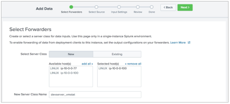
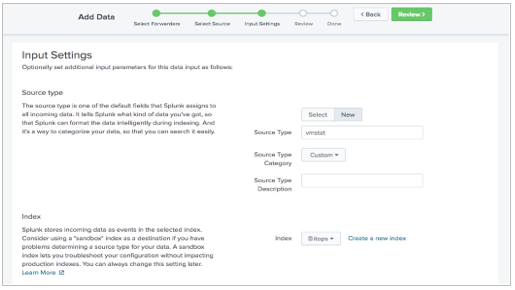
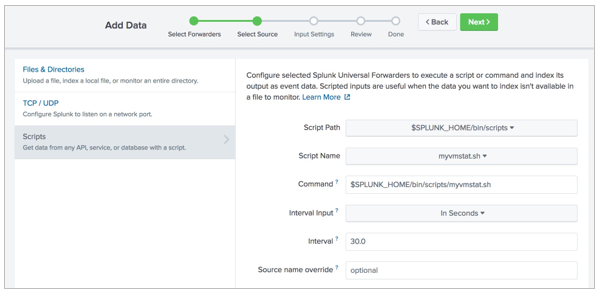
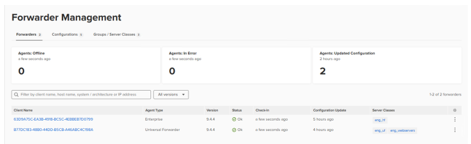
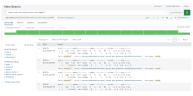
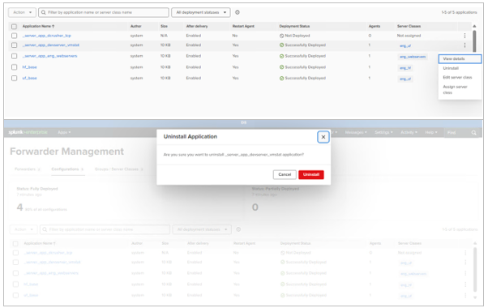
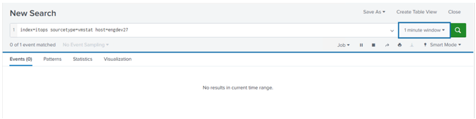

# Module 6 Lab Exercise – Remote Scripted Input 

## Objective:
By the end of the session, you will be able to:
- Objetive - The Linux vmstat command is a useful tool for gathering a snapshot of system information such as memory usage, processes, and CPU load. Indexing this data in Splunk is useful for trending analysis and capacity planning.
In this lab exercise, you will deploy a scripted input to a Linux forwarder and collect vmstat data.

## Time for this activity:
- 30 minutes.

## Instructions: 
<!-- Provide detailed steps on how to configure and manage systems, implement software solutions, perform security testing, or any other practical scenario relevant to the field of Information Technology -->

### Task 1. Add a scripted input on your deployment server and deploy it to the forwarder #2.

**Step 1.** 1.	From the deployment server’s filesystem, copy the /opt/scripts/myvmstat.sh file to the
SPLUNK_HOME/bin/scripts folder.

**Step 2.** From the deployment server, click Settings > Add Data > Forward.

**Step 3.** On the Select Forwarders step, configure the form as follows, and then click Next:
•	Select Server Class: New
•	Selected host(s): LINUX IP 10.7.3X.12
•	New Server Class Name: devserver_vmstat

**Step 4.** On the Select Source step, click Scripts and configure the form as follows and click Next:
•	Script Path: $SPLUNK_HOME/bin/scripts
•	Script Name: myvmstat.sh
•	Command: $SPLUNK_HOME/bin/scripts/myvmstat.sh 
•	You can also put the script in $SPLUNK_HOME/etc/deployment-apps/app_name/bin/myvmstat.sh (you will need to copy it manually.
•	Interval: 30

**Step 5.** For the Input Settings, select New, enter Source type as vmstat and select itops for the Index, and click Review:

**Step 6.** Make sure the input settings match the following:
Server Class Name	  devserver_vmstat
List of Forwarders	  LINUX IP 10.7.3X.12
Input Type	  Script
Command	  $SPLUNK_HOME/bin/scripts/myvmstat.sh
Interval	  30
Source name override	  N/A
Source type	  vmstat
Index	  itops

**Step 7.** Click Submit.

**Step 8.** For Windows Students Only: Remote SSH to forwarder #2 and change the file permission of the script:

NOTE:	Windows students must perform the above step every time a scripted input is re-deployed to a Linux forwarder.

**Step 9.** You should see a page like this when you finish the forwarding input.

### Task 2. Verify the output of your scripted input.

**Step 1.** From the search head, replace the #with your student ID and execute the following search over the
Last 15 minutes.
index=itops sourcetype=vmstat host=engdev2#
You may need to wait a few moments to see results. When you do, do not navigate away from these search results.

### Task 3. Disable the forward scripted input.
After you confirm the scripted input is working, uninstall the deployment app. You are doing this to reduce the system load on the forwarder, as it is a shared host in this lab environment.

**Step 1.** On the deployment server, navigate to Settings > Forwarder management and click the Apps tab.

**Step 2.** For the app _server_app_devserver_vmstat, click Edit > Uninstall > Uninstall.

**Step 3.** Switch back to the search head window/tab and change the time range of the search to:
REAL-TIME > 1 minute window

**Step 4.** Wait until the event count drops to 0 (0 of X events matched) and then stop (click ) the real-time search.

**Step 5.** Troubleshooting Suggestions (for Deploy a Remote Scripted Input)
If the scripted input is not returning the expected results, troubleshoot by isolating the issue.
1.	Verify the syntax and spelling.
Verify the script name in the inputs.conf has the full script name including the .sh extension.
2.	Search for forwarder errors in the internal index: 
index=_internal sourcetype=splunkd component=ExecProcessor host=engdev2#
3.	Test your script on the forwarder and confirm that the script itself is producing some output.

4.	Check for any errors in the splunkd.log on the forwarder #2 for script actions.

5.	Check for any scripted input related splunkd logs.

An error message bad interpreter in the forwarder’s splunkd.log indicates that *nix scripts were drafted using a Windows OS. A file created in a Windows environment may be using a DOS-based carriage return. Check the file format of the myvmstat.sh file and convert it to a UNIX format.
If you still don't see events on the search head, ask your instructor for help.
