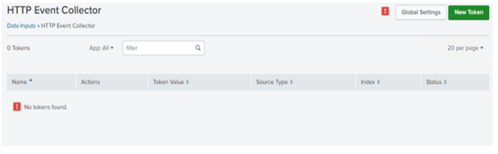
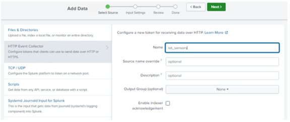
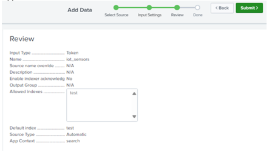
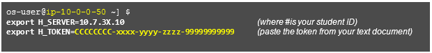
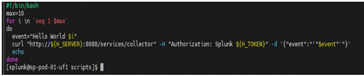
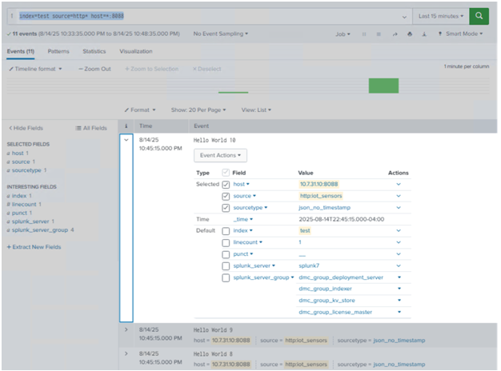
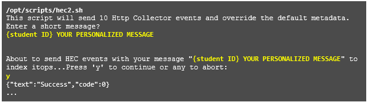
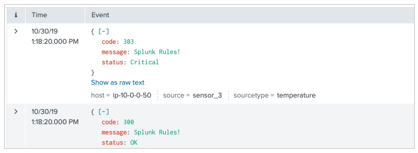

# Module 7 Lab Exercise – HTTP Event Collector. 

## Objective:
By the end of the session, you will be able to:
- Objetive 1 - In this lab exercise, you enable and configure the HTTP event collector on the deployment/test server. Once configured, you can transmit HTTP data and the deployment/test server will parse the data and forward the resulting events to the local indexers.

## Time for this activity:
- 25 minutes.

## Instructions: 
<!-- Provide detailed steps on how to configure and manage systems, implement software solutions, perform security testing, or any other practical scenario relevant to the field of Information Technology -->

### Task 1. Enable HTTP event collector on your HTTP Event Collector Receiver (deployment server).

**Step 1.** On the deployment server, navigate to Settings > Data inputs.

**Step 2.** From Local inputs, click HTTP Event Collector.

**Step 3.** Click Global Settings.

**Step 4.** Select the following settings:
All Tokens	Click the Enabled button
Default Source Type	Structured > json_no_timestamp
Default Index	test
Default Output Group	None
Use Deployment Server	off	(Leave the box unchecked)
Enable SSL	off	(Uncheck the box)
HTTP Port Number	8088

**Step 5.** Click Save.

**Step 6.** Click New Token.
The Select Source step of the Add Data wizard opens with the HTTP Event Collector selected in the left panel.

**Step 7.** In the Name field, type: iot_sensors

**Step 8.** From the Output Group (optional), notice that None is selected in the dropdown menu and click
Next

**Step 9.** On the Input Settings page, set the values to the following: 
Source type	Automatic
Select Allowed Indexes	Add itops and test to the Selected item(s)
Default Index	test

**Step 10.** Click Review and make sure all the settings match: 
Input Type	Token
Name	iot_sensors
Source name override	N/A
Description	N/A
Enable indexer acknowledgements	No
Output Group	N/A
Allowed indexes	itops and test
Default index	test
Source Type	Automatic
App Context	search

**Step 11.** Click Submit.
The Token has been created successfully message displays with the token value of the collector. You will share this token with the developers who will send events to the indexer.

**Step 12.** Copy the Token Value and save it to a text document.

### Task 2. Send test events to your indexer.
In real practice, developers would create programs or scripts to send events to the receiving collector. In this lab environment, scripts are provided for you.

**Step 1.** 13.	From your deployment server, remote SSH to your forwarder #1 (10.7.3X.11).

**Step 2.** 14.	Execute the following commands to set environment variables for the HEC events:

These variables set the IP address and HTTP token for the upcoming curl commands.

**Step 3.** 15.	To send basic Event Collector data, examine and run the hec1.sh script in /opt/scripts:

The script uses the following curl command to submit the JSON events to your indexer:
curl http://${H_SERVER}:8088/services/collector \
-H "Authorization: Splunk ${H_TOKEN}" \
-d ' {"event": "Hello World 1"}'
If you get the curl: (6) Could not resolve host message, make sure H_SERVER is set to your deployment server's IP address.
If you get the the curl: (7) Failed to connect to 10.7.3X.10 port 8088:Connection refused message, verify your HTTP Event Collector global settings.
If the submit is successful, you will get the {"text":"Success","code":0} message 10 times. If it fails, you will see an error message; e.g. {"text":"Invalid token","code":4}

**Step 4.** 16.	From your deployment/test server, execute the following search over the last 15 minutes.
index=test source=http* host=*:8088

Each successful run indexes 10 events. You should see the following field values: host = 10.7.3X.10:8088
source = http:iot_sensors
sourcetype = json_no_timestamp

**Step 5.** 17.	To send another set of events that override the default metadata, run the hec2.sh script and, when prompted to enter a message, type your student ID followed by a personalized message. Important: The message must begin with your student ID in order to validate the data. (Note: If you have exited the terminal window since running the export commands in step #14, ensure you run those commands again prior to running this script.)

The hec2.sh script uses the following curl command to override the default metadata:
curl http://${H_SERVER}:8088/services/collector \
-H "Authorization: Splunk ${H_TOKEN}" \
-d '{"index":"'"$index"'", "host":"'"$HOSTNAME"'", "sourcetype":"'"$sourcetype"'",
source":"'"$source"'", "event":{"code":"'"$code"'", "status":"'"$status"'", "message":"'"$msg"'"}}'

**Step 6.** 18.	Close your remote SSH session

**Step 7.** 19.	From your deployment/test server, execute the following search over the last 15 minutes.

**Step 8.** 20.	index=test

**Step 9.** Troubleshooting Suggestions
If you get the error message, "curl: (56) Recv failure: Connection reset by peer", it means you did NOT uncheck the Enable SSL box in the Global Settings (Step 4).

1.	Confirm the resulting input stanzas on the deployment server:

[http] disabled = 0
enableSSL = 0 index = test
sourcetype = json_no_timestamp

...
[http://iot_sensors] disabled = 0
index = test
indexes = itops,test token = <generated_token>

2.	Use the btool command with the --debug argument to display the iot_sensor inputs.conf stanzas
deploymentclient.conf file.

/opt/splunk/etc/apps/search/local/inputs.conf [http://iot_sensors]
/opt/splunk/etc/system/default/inputs.conf	_rcvbuf = 1572864
/opt/splunk/etc/apps/search/local/inputs.conf disabled = 0
/opt/splunk/etc/system/local/inputs.conf	host = ip-10-0-0-2##
/opt/splunk/etc/apps/search/local/inputs.conf index = test
/opt/splunk/etc/apps/search/local/inputs.conf indexes = itops,test
/opt/splunk/etc/apps/search/local/inputs.conf token = <generated_token>

