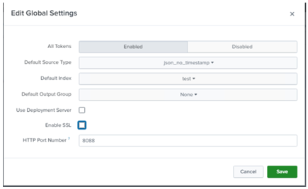

# Module 7 Lab Exercise – HTTP Event Collector. 

## Objective:
By the end of the session, you will be able to:
- Objetive 1 - In this lab exercise, you enable and configure the HTTP event collector on the deployment/test server. Once configured, you can transmit HTTP data and the deployment/test server will parse the data and forward the resulting events to the local indexers.

## Time for this activity:
- 25 minutes.

## Instructions: 
<!-- Provide detailed steps on how to configure and manage systems, implement software solutions, perform security testing, or any other practical scenario relevant to the field of Information Technology -->

### Task 1. Enable HTTP event collector on your HTTP Event Collector Receiver (deployment server).

**Step 1.** On the deployment server, navigate to Settings > Data inputs.

**Step 2.** From Local inputs, click HTTP Event Collector.

**Step 3.** Click Global Settings.

**Step 4.** Select the following settings:
All Tokens	Click the Enabled button
Default Source Type	Structured > json_no_timestamp
Default Index	test
Default Output Group	None
Use Deployment Server	off	(Leave the box unchecked)
Enable SSL	off	(Uncheck the box)
HTTP Port Number	8088

**Step 5.** Click Save.

**Step 6.** Click New Token.
The Select Source step of the Add Data wizard opens with the HTTP Event Collector selected in the left panel.

**Step 7.** In the Name field, type: iot_sensors

**Step 8.** From the Output Group (optional), notice that None is selected in the dropdown menu and click
Next

**Step 9.** On the Input Settings page, set the values to the following: 
Source type	Automatic
Select Allowed Indexes	Add itops and test to the Selected item(s)
Default Index	test

**Step 10.** Click Review and make sure all the settings match: 
Input Type	Token
Name	iot_sensors
Source name override	N/A
Description	N/A
Enable indexer acknowledgements	No
Output Group	N/A
Allowed indexes	itops and test
Default index	test
Source Type	Automatic
App Context	search

**Step 11.** Click Submit.
The Token has been created successfully message displays with the token value of the collector. You will share this token with the developers who will send events to the indexer.

**Step 12.** Copy the Token Value and save it to a text document.

### Task 2. Description of the task to be performed.

**Step 1.** The instructor must describe each activity using the infinitive form of the verb, clearly and concisely, in order to build the task objective step by step.

**Step 2.** <!-- Add instruction, e.g., "To configure the network interface with the assigned IP address." -->

**Step 3.** <!-- Add instruction, e.g., "To verify connectivity by executing ping commands to the server." -->

## Expected result:

This section should show the expected outcome of our lab activity.

