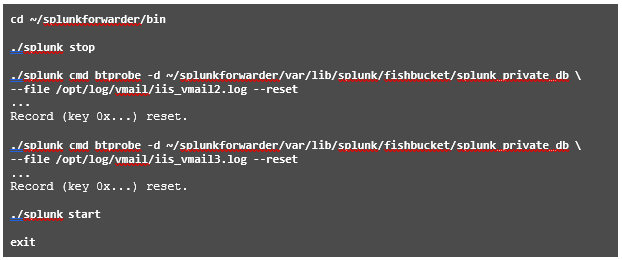

# Module 8 Lab Exercise – Fine-tuning Inputs 

## Objective:
By the end of the session, you will be able to:
- Objetive - In this lab exercise, you add a remote directory monitor input to index several sources on UF2 using the automatic source typing feature. While this is a convenient feature, Splunk does not always assign the correct sourcetype for every file in a directory. When this happens, you must intervene to override the sourcetype.

## Time for this activity:
- 30 minutes.

## Instructions: 
<!-- Provide detailed steps on how to configure and manage systems, implement software solutions, perform security testing, or any other practical scenario relevant to the field of Information Technology -->

### Task 1. Add a remote test directory monitor input to sample the auto-sourcetype behavior.

**Step 1.** From your deployment server, click Settings > Add Data > Forward.

**Step 2.** On the Select Forwarders step, configure the form as follows:
•	Selected host(s): LINUX UF2 - ip-10.7.3X.12
•	New Server Class Name: devserver_vmail

**Step 3.** On the Select Source step, click Files & Directories and and configure the File or Directory to
/opt/log/vmail, and click Next:

**Step 4.** For the Input Settings, leave the Source type to Automatic, select the test index, and click
Review.

**Step 5.** Verify your input matches the following and click Submit: 
Server Class Name	devserver_vmail
List of Forwarders	LINUX|ip-10.7.3X.10
Input Type	File Monitor
Source Path	/opt/log/vmail
Whitelist	N/A
Blacklist	N/A
Source Type	Automatic
Index	test

**Step 6.** From your search head, execute the following search over the Last 30 days, replacing # with your student ID:
index=test source=*vmail* host=engdev2#
You should see the following field values:
host:	            engdev2#
source (4 total):	/opt/log/vmail/iisvmail1.log
                  /opt/log/vmail/iisvmail2.log
                  /opt/log/vmail/iisvmail3.log
                  /opt/log/vmail/iisvmail4.log
sourcetype:	      iis_vmail-2 and iis_vmail

### Task 2. Override the sourcetype of iis_vmail3.log.
In this task, you create a props.conf file in the deployment-apps directory and deploy it to your second forwarder. This file does not currently exist. You also edit the directory input to re-send the data to the itops index. Because the data has already been transmitted, you will use the btprobe command to reset the file checkpoints for two of the log files.

**Step 1.** From your deployment server, use a text editor to create a new props.conf file at:

**Step 2.** Insert the following text:
[source::/opt/log/vmail/iis_vmail3.log] 
sourcetype = acme_voip

**Step 3.** Save and close the file.

**Step 4.** Open the inputs.conf file for the vmail directory input.

**Step 5.** Change the vmail directory input’s index attribute as follows:
[monitor:///opt/log/vmail] 
disabled = false
index = itops	(Change)

**Step 6.** Save and close the file.

**Step 7.** To re-deploy the modified input, run the following command: (Note that Splunk may prompt you for the admin username and password.)

NOTE:	You are deploying the props.conf and the inputs.conf updates to UF2. Data is not parsed on the universal forwarder; the source type override functionality is an input phase activity. Later, you will deploy props.conf to the heavy forwarder to parse data prior to sending the data to the indexers.

**Step 8.** Remote SSH into UF2 (10.7.3X.12) and verify the update was deployed.

**Step 9.** To trigger the re-indexing of the same sources on the forwarder, the monitor checkpoints must be reset on UF2 (10.7.3X.12).
To clear the individual checkpoints for two of the iis_vmail logs, run the following commands.

### Task 3. Verify the source type.

**Step 1.** From the search head, execute the following search over the Last 30 days, replacing #with your student ID:
index=itops source=*vmail* host=engdev2#| stats count by source, sourcetype

**Step 2.** Confirm that iis_vmail3.log is now using the overridden sourcetype acme_voip, while the other sources are still using the automatic sourcetype values of iis_vmail and/or iis_vmail-2.

### Task 4. Troubleshooting Suggestions
If the configuration is not producing the expected results, check your configurations.

**Step 1.** 1.	Verify the syntax, spelling, and the key values in the configuration files.

**Step 2.** 2.	Check the splunkd.log on the forwarder for any monitoring process errors.

**Step 3.** 3.	If you make any stanza corrections, reset each monitor checkpoint on the forwarder.

**Step 4.** 4.	If you still don't get results, ask your instructor for help.
