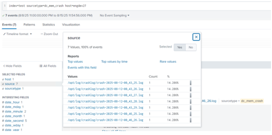

# Module 9 Lab Exercise – Create a New Source Type 

## Objective:
By the end of the session, you will be able to:
- Objetive - In this exercise, you create two custom source types from two types of data files. The files on the UF2 are considered the production logs. In the lab environment, the deployment server contains the same log files as the forwarders. In a real-world environment, you would need to obtain samples of a production server’s data files and manually copy them to the deployment server’s or other testing server’s file system if you wanted to use the Data Preview feature.
Normally, using a dedicated deployment server, the provisioning steps are:
•	On the deployment server, you configure the parsing attributes in props.conf to process a custom sourcetype using the data preview.
•	On the deployment server, you add the same custom sourcetype as a selectable sourcetype.
•	Using an appropriate distribution mechanism, you deploy the props.conf file generated by the Data Preview feature to your indexers. The distribution mechanism depends upon whether your indexers are clustered or non-clustered.
Each forwarder sends its event data marked with the sourcetype to the indexers. During parsing, the indexers extract the proper timestamps and set event boundaries according to the props.conf stanza configurations.
During this lab exercise, you will configure a heavy forwarder (10.7.3X.15) to receive data from UF2 and parse the data before it is forwarded to the indexers. Therefore, you create and maintain the props.conf file on the deployment server and deploy it to the heavy forwarder. This is a typical Splunk Cloud configuration. For Splunk on-prem deployments, the props.conf is deployed to the indexers.

NOTE:	This lab exercise has several tasks and steps. Successful completion is crucial to complete the subsequent lab exercises.

## Time for this activity:
- 45 minutes.

## Instructions: 
<!-- Provide detailed steps on how to configure and manage systems, implement software solutions, perform security testing, or any other practical scenario relevant to the field of Information Technology -->

### Task 1. Add a local monitor input on the deployment server.
In this task, you use the Add Data wizard’s data preview feature to create a local data input and a new source type that contains custom parsing phase attributes. The custom attributes are needed to correctly parse events from a proprietary (not industry standard) log file.

**Step 1.** From the deployment server, click Settings > Add Data > Monitor.

**Step 2.** On the Select Source step, click Files & Directories.

**Step 3.** Click Browse to navigate and select one of the crash log files (do not select file dreamcrusher.xml):

**Step 4.** Verify Continuously Monitor is selected and click Next.
On the Set Source Type step, note that the data preview panel displays one event.

**Step 5.** To have Splunk treat this as a single event using only the timestamp on the first line, click
Timestamp > Advanced….

**Step 6.** Change the Lookahead value to 30 and press Tab.
After the adjustment, the data preview panel should now display only one event.

**Step 7.** Still on the same step, click Save As to save the sourcetype as follows: 
Name:	dc_mem_crash
Description:	Dream Crusher server memory dump
Category:	Application
App:	Search & Reporting

**Step 8.** Click Save.

**Step 9.** Expand the Advanced section on the left and click Copy to clipboard.

**Step 10.** Review the props.conf attributes produced by your customizations, then click Cancel.

**Step 11.** Click Next to proceed to Input Settings.

**Step 12.** On the Input Settings step, make sure App Context is set to Search & Reporting (search) and select test for the Index.

**Step 13.** Click Review and verify that your input matches the following before clicking Submit. 
Input Type	File Monitor
Source Path	/opt/log/crashlog/crash-XXXX-XX-XX-XX_XX_XX.log
Continously Monitor	Yes
Source Type	dc_mem_crash
App Context	search
Host	splunk#
Index	test

**Step 14.** Click Start Searching.
You should have a single event displayed. If you do, continue to the next task. If not, consult the
Troubleshooting Suggestions and repeat the task.

### Task 2. Build an input to index an XML file.
In this task, you create a new data input to parse an XML file. Splunk cannot parse the XML data correctly using the automatic (default) parsing attributes. Use the Add Data wizard to create another new custom source type that correctly breaks the XML data into events and extracts a timestamp from within each event.

**Step 1.** From the deployment server’s command line, open the following file in a text editor to examine the structure of the XML data:

Each <Interceptor> node represents a legitimate event record.
The <ActionDate> tag contains the event timestamp in EST time zone.

**Step 2.** In Splunk Web on the deployment server, launch the Add Data Wizard and add a new Monitor input. Select Files & Directories, set the File or Directory to the full path to the dreamcrusher.xml file, leaving the default for Continously Monitor, and then click Next.

**Step 3.** On the Set Source Type step, notice the auto event breaking of the XML file is not parsing the file correctly. You’ll need to define custom attributes to correct this situation

**Step 4.** Configure the event breaking and the timestamp extraction as follows:
•	Expand the Event Breaks section, click Regex... and for Pattern, type:
([\r\n]+)\s*<Interceptor>
•	Press Tab. (You should see the XML data placed in proper multi-line events.)
•	To see the <ActionDate> tag (timestamp) of the second event, click Show all #lines.
•	Expand the Timestamp section and configure as follows: 
  Extraction:	Advanced…
  Time zone:	(GMT-5:00) Eastern Time (US & Cananda)
  Timestamp format:	%Y-%m-%d
  Timestamp prefix:	<ActionDate>
•	Press Tab. (You should see the dates updated correctly for these events.)

NOTE:	This timestamp extraction will not be applied to the XML root element. You can safely ignore the warning icon on the first event. All subsequent events should no longer display a warning at this point. The displayed timestamps should each have the correct date.

**Step 5.** Click Save As to save the source type configuration as follows: 
Name:	dcrusher_attacks
Description:	Dream Crusher user interactions
Category:	Application
App:	Search & Reporting

**Step 6.** Click Save, then Next.

**Step 7.** On the Input Settings step, make sure the App Context is set to Search & Reporting (search) and select the test index.

**Step 8.** Verify the Review page matches the following: 
Input Type	File Monitor
Source Path	/opt/log/crashlog/dreamcrusher.xml
C:\opt\log\crashlog\dreamcrusher.xml
Continuously Monitor	Yes
Source Type	dcrusher_attacks
App Context	search
Host	splunk#
Index:	test

**Step 9.** Click Submit.

**Step 10.** Click Start Searching.
If each event starts with <Interceptor>, displays the correct timestamp, and the sourcetype is set to dcrusher_attacks, continue with the next task. Ignore the XML header event containing <?xml version...
If not, consult the Troubleshooting Suggestions and repeat the task.

### Task 3. Prepare the props.conf file on the deployment/test server.

**Step 1.** In the terminal window connected to the deployment server, copy the contents of the props.conf file to the hf_base directory.

**Step 2.** Reload the deployment server. (Splunk may ask you to login as the admin Splunk user).

**Step 3.** Remote SSH to splunkHF (10.7.3X.15) and make sure the new [dc_mem_crash] and
[dcrusher_attacks] stanzas appear in the deployed props.conf file:
Your dc_mem_crash and dcrusher_attacks stanzas should match the output shown below:

### Task 4. Deploy a directory monitor to UF2 to index the crash logs into the test index.
In this task, you will create a remote input with the Add Data wizard to monitor the crashlog files from UF2. You will need to exclude the dreamcrusher.xml file while creating the remote input.

**Step 1.** From the deployment server, click Settings > Add Data > Forward.

**Step 2.** On the Select Forwarders step, configure the form as follows:
•	Select Server Class: New
•	Selected host(s): LINUX ip-10.7.3X.12
•	New Server Class Name: eng_crashlog

**Step 3.** On the Select Source step, click Files & Directories click Files & Directories and configure the form as follows, and click Next:
•	File or Directory: /opt/log/crashlog
•	Includelist: dreamcrusher\.xml

**Step 4.** For the Input Settings, for the Source type click on Select and select Application > dc_mem_crash
sourcetype defined earlier, and the test index.

**Step 5.** Define input settings as follow and click Next

**Step 6.** Verify the Review page matches the following, then click Submit: 
New Server Class Name	eng_crashlog
Selected host(s)	LINUX | IP 10.7.3X.12
Input Type	File Monitor
Source Path	/opt/log/crashlog
Includelist	N/A
Excludelist	dreamcrusher\.xml
Source Type	dc_mem_crash
Index	test

**Step 7.** From the search head, execute the following search over All Time, replacing # with your student ID:
index=test sourcetype=dc_mem_crash host=engdev2#

The number of entries you see should equal one entry per crash log file in the /opt/log/crashlog folder on the UF2 system. To verify, login to UF2 (10.7.3X.12) using a terminal window, and run the command: ls /opt/log/crashlog/crash*.log. For example, if you see 7 source files, you should see 7 events. If instead you see multiple events per source file, verify your configurations by consulting the Troubleshooting Suggestions and repeat the task.

### Task 5. Deploy a file monitor to UF2 to transmit the dreamcrusher.xml data.
In this task, you add a Forward input to monitor dreamcrusher.xml on UF2. The XML file is forwarded to your heavy forwarder for line breaking and timestamp extraction. The parsed events are then forwarded to the indexers.

**Step 1.** From the deployment server, launch the Add Data wizard and add a Forward input to monitor
dreamcrusher.xml on UF2 (10.7.3X.12). Send the data to the test index.
•	On the Select Forwarders step: Selected Server Class	New
Selected host(s)	LINUX|IP 10.7.3X.12
New Server Class Name	eng_dreamcrusherXML
•	On the Select Source step, select Files & Directories:
File or Directory	/opt/log/crashlog/dreamcrusher.xml
•	On the Input Settings step:
Source type	Select, using Application > dcrusher_attacks
Index	test

**Step 2.** Verify the Review page matches the following before clicking Submit: 
Server Class Name	eng_dreamcrusherXML
List of Forwarders	LINUX|IP 10.7.3X.12
Input Type	File Monitor
Source Path	/opt/log/crashlog/dreamcrusher.xml
Whitelist	N/A
Blacklist	N/A
Source Type	dcrusher_attacks
Index	test

**Step 3.** From the search head, execute the following search over All Time, replacing the # with your student ID (it can take a few minutes for the data to display on the search head):
index=test sourcetype=dcrusher_attacks host=engdev2#

You should now see a total of 918 events. Except for the first event, all events should begin with the
<Interceptor> tag.
The total event count for dcrusher_attacks sourcetype is 918. If you get a different count, why is that?
If the event count is not 918, there could be several reasons:
•	Misconfigured event breaking.
•	Verify the events from the UF2 (host=engdev2#) are the only ones being searched.

**Step 4.** Troubleshooting Suggestions
1.	For task 1, verify the props.conf file located in the SPLUNK_HOME/etc/apps/search/local
directory on the deployment/test server has the following stanza:
[dc_mem_crash]
DATETIME_CONFIG =
LINE_BREAKER = ([\r\n]+)
MAX_TIMESTAMP_LOOKAHEAD = 30
NO_BINARY_CHECK = true
category = Application
description = Dream Crusher server memory dump
pulldown_type = true
 
2.	For task 2, verify the props.conf file located in the SPLUNK_HOME/etc/apps/search/local directory on the deployment/test server has the following stanza for dcrusher_attacks in addition to the dc_mem_crash stanza:
[dcrusher_attacks]
BREAK_ONLY_BEFORE_DATE =
DATETIME_CONFIG =
LINE_BREAKER = ([\r\n]+)\s*<Interceptor>
NO_BINARY_CHECK = true
SHOULD_LINEMERGE = false
TIME_FORMAT = %Y-%m-%d
TIME_PREFIX = <ActionDate>
TZ = America/New_York
category = Application
description = Dream Crusher user interactions
disabled = false
pulldown_type = true

NOTE:	After you deploy the props.conf to the heavy forwarder, props.conf file should have the
dc_mem_crash and dcrusher_attacks stanzas.

3.	If you are not seeing data, verify inputs.conf for crashlog and dreamcrusher.xml on your deployment/test server,

[monitor:///opt/log/crashlog] blacklist = dreamcrusher\.xml disabled = false
index = test
sourcetype = dc_mem_crash

[monitor:///opt/log/crashlog/dreamcrusher.xml] disabled = false
index = test
sourcetype = dcrusher_attacks

4.	If you make any stanza corrections, reset the monitor checkpoints on UF2.

NOTE: The btprobe command is shown across three lines but it should be entered on a single line. Replace <xxxx...> with the actual name.
If you still don't get results, ask your instructor for help.
